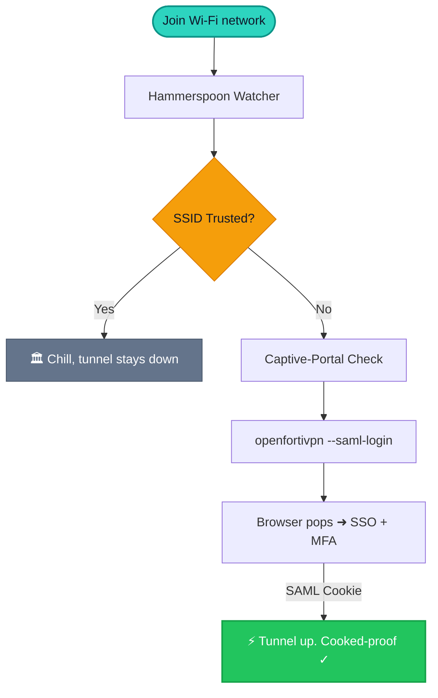

# fortivpn-auto ⚡

> **wifi flips → vpn rips.** 🛜 your FortiGate SSL-VPN connects itself the second
> you hop on sketchy Wi-Fi, and dips the moment you're back on a network you
> trust. zero babysitting, zero FortiClient GUI, zero `--insecure-ssl` nonsense.


Built for the UCalgary VPN 🎓, but it's gateway-agnostic — point it at any
**FortiGate gateway that does SAML SSO** and you're set. There's a UCalgary
preset so locals can skip the config entirely.

---

## 😎 the vibe

You're at a café ☕. You join the Wi-Fi. Normally you'd remember the VPN *after*
your first request leaks in the clear, fumble open FortiClient, click through a
GUI that breaks every macOS update. **Nah.** This watches your SSID and handles
it for you:



- 📞 **the dial:** [`openfortivpn`](https://github.com/adrienverge/openfortivpn) (`--saml-login`) — a protocol client, not a GUI we have to puppet.
- 🧠 **the brain:** [Hammerspoon](https://www.hammerspoon.org/) watches Wi-Fi + runs the state machine + gives you a menubar.
- 🔑 **the login:** your default browser. password manager + Microsoft Authenticator do their thing there.
- 🛡️ **the trust:** the gateway cert is **pinned**, not vibe-checked. more in [Security](#-security-no-cap).

---

## 📋 before you start

- 🍎 macOS 13+ (Apple Silicon **or** Intel — we detect which)
- 🍺 [Homebrew](https://brew.sh) — we use it, but we won't install it behind your back (it touches admin + your shell profile, that's a *you* decision)
- 📦 everything else (`openfortivpn` ≥ 1.21, Hammerspoon) the installer grabs for you

---

## 🚀 install (it's two lines fr)

```bash
brew install rahit/tap/fortivpn-auto
fortivpn-auto install --preset ucalgary      # UCalgary squad
```

`brew` pulls `openfortivpn` + the Hammerspoon cask for you. The `install` step
does the per-Mac wiring a formula can't (config, Spoon, scoped sudoers,
LaunchAgent) — it needs `sudo` and your gateway details, so it's its own step.

Not at UCalgary? Bring your own gateway:

```bash
curl -fsSL https://raw.githubusercontent.com/rahit/fortivpn-auto/main/vpn.conf.example -o ~/vpn.conf
$EDITOR ~/vpn.conf                            # GATEWAY_HOST, GATEWAY_PORT, TRUSTED_SSIDS
fortivpn-auto install --config ~/vpn.conf
```

<details><summary>prefer to run from source (audit-first)?</summary>

```bash
git clone https://github.com/rahit/fortivpn-auto.git
cd fortivpn-auto
./bin/fortivpn-auto install --preset ucalgary
```
</details>

The installer is **idempotent** ♻️ (re-run it all day, nothing breaks) and
**allergic to clobbering your stuff**:

- already have a `~/.hammerspoon/init.lua`? we don't touch it — we drop a Spoon
  and append a tiny **sentinel-guarded block** that coexists with your setup.
- existing openfortivpn config? **backed up** 💾 (timestamped) before we write.
- the sudoers grant goes in **only after `visudo` says the syntax is valid** —
  a malformed sudoers file can lock you out of `sudo`, so we never raw-`cp` it.

`sudo` prompts once (for that sudoers step). Want to launch Hammerspoon yourself
and skip the auto-start agent? add `--no-agent`.

---

## 🔐 the manual bit (macOS won't let a script click these, sorry)

Grant these to **Hammerspoon**:

1. 📍 **Location Services** — yes, *Location*, for a VPN tool. since macOS Sonoma,
   reading your Wi-Fi network name is gated behind it. skip this and the watcher
   *silently* thinks you have no Wi-Fi and ghosts you. the Spoon throws the
   prompt on launch → smash **Allow**. no prompt? open the Hammerspoon Console:
   ```lua
   hs.location.start()
   ```
   then toggle Hammerspoon on under **System Settings → Privacy & Security →
   Location Services**.
2. ♿ **Accessibility** + 🔔 **Notifications** — allow if asked. Notifications is
   just for the status banners; no glaze.

**did it work?** Hammerspoon Console → `hs.wifi.currentNetwork()` should return
your SSID, **not `nil`**. `nil` = Location Services isn't granted. that's it,
that's the whole gotcha.

---

## 🩺 is it cooked? (verify + test)

```bash
fortivpn-auto doctor             # read-only health check, green/yellow/red on every part
fortivpn-auto doctor --dry-run   # + gateway reachability & captive-portal probe (no dial)
```

`doctor` literally draws you a results bar 📊 so you know at a glance. Then the
real test: yeet yourself off trusted Wi-Fi (phone hotspot is easiest). Menubar
goes `VPN ⋯` → `VPN ⟳`, browser pops for SSO, you MFA, menubar hits **`VPN ✓`**.
Back on home Wi-Fi → `VPN 🏛`, tunnel drops. Logs live rent-free in
`~/Library/Logs/fortivpn-auto.log`.

| menubar | meaning |
|---|---|
| `VPN ⏸` | idle, no Wi-Fi |
| `VPN 🏛` | on a trusted network, chilling |
| `VPN ⋯` / `VPN ⟳` | probing / connecting |
| `VPN ✓` | tunnel up, you're routed |
| `VPN ✗` | it flopped — check the log, hit *Force connect* |

---

## ⚙️ config (`vpn.conf`)

| key | required | what it does |
|---|---|---|
| `GATEWAY_HOST` | ✅ | FortiGate hostname (no scheme/port) |
| `GATEWAY_PORT` | ✅ | SSL-VPN port (usually `10443`) |
| `TRUSTED_SSIDS` | ✅ | bash array of SSIDs where the VPN should **chill** (no connect) |
| `TRUSTED_CERT` | — | pin a specific SHA-256; empty = fetch + pin the live cert at install |
| `OPENFORTIVPN_BIN` | — | override binary path; empty = auto-detect |
| `REALM` | — | SAML realm segment, if your gateway demands one |
| `PERSISTENT_RECONNECT` | — | seconds between auto-reconnect attempts (default 25; 0 = off) |
| `KEEPALIVE_INTERVAL` | — | ping through the tunnel every N s to dodge an idle timeout (0 = off) |
| `KEEPALIVE_HOST` | — | keepalive target; empty = the tunnel's gateway peer |
| `START_DELAY` / `RETRY_DELAY` / `MAX_RETRIES` | — | state-machine tuning |

---

## 🔁 cert rotated? (happens ~yearly, don't panic)

FortiGate EV certs renew annually. When that drops, the next connect fails with
*Gateway certificate validation failed* (you'll get a notification too):

```bash
fortivpn-auto refresh-cert      # grabs the live digest, re-pins after you confirm
```

We **never** fall back to `--insecure-ssl`. That disables cert validation
entirely and hands you to whoever owns the café router — on the exact untrusted
Wi-Fi this tool exists for. Hard pass. 🙅

---

## 💓 staying alive

`install.sh` drops a per-user **LaunchAgent** that boots Hammerspoon at login and
*relaunches it if it crashes* (`KeepAlive = SuccessfulExit:false`) — but if you
deliberately Quit, it stays quit. It's self-healing but not clingy. Beats the
"Launch at login" checkbox because it's scriptable, reversible, and shows up
honestly in System Settings → General → Login Items.

---

## 🔁 staying *connected* (drops on Wi-Fi change / inactivity)

Two different drop causes, two fixes — plus one hard limit:

- **Wi-Fi change / transient drop →** `PERSISTENT_RECONNECT` (default `25`s). openfortivpn
  reconnects on its own and **reuses the SAML cookie — no re-login** — until the gateway
  expires it. (Note: the number is the retry *interval*, not a session lifetime; it already
  loops forever, so keep it short.)
- **Idle timeout →** `KEEPALIVE_INTERVAL` (e.g. `120`s). A small ping through the tunnel keeps
  the session "active" so the gateway doesn't reap it for inactivity. openfortivpn sends no
  keepalive of its own, so this is the lever. Only helps an *idle* timeout.
- **Hard session cap (can't be beaten) →** when the gateway's max-session timer fires, the
  cookie is dead and a fresh SAML SSO + MFA is **mandatory** — that's UCalgary IT policy, not
  something the client can extend. When that happens, the watchdog notices the tunnel has been
  down too long and **restarts for a fresh browser login** automatically (rather than looping
  silently on a dead cookie).

**Don't know your gateway's timeouts?** Measure: connect, `tail -f ~/Library/Logs/fortivpn-auto.log`,
and time the drop — once left **idle**, once kept **active** (a steady `ping`). Idle-only drop ⇒
set `KEEPALIVE_INTERVAL` under that; fixed wall-clock drop regardless ⇒ that's the hard cap.

---

## 🛠️ when it's being sus (troubleshooting)

- 📍 **menubar stuck on `VPN ⏸`, log spams `SSID is nil`** → Location Services not
  granted. see [the manual bit](#-the-manual-bit-macos-wont-let-a-script-click-these-sorry). `doctor` flags this for you.
- 🔑 **`sudo` keeps asking for a password on connect** → the sudoers path doesn't
  match your `openfortivpn`. re-run `fortivpn-auto install`, it auto-detects the real one.
- 🌐 **browser never opens for SSO** → grab the URL from the log (search `saml`)
  and open it by hand; check your default-browser binding.
- 🧭 **tunnel's up but internal sites won't load** → split-DNS. peek at
  `scutil --dns` for VPN resolvers on the `ppp0` interface.
- 🍪 **`Failed to retrieve SAML cookie`** → usually a stale gateway session or the
  browser dead-ended on the FortiGate web portal. close those tabs, hit the
  menubar's *Force connect*, try again.

---

## 🧹 uninstall (no hard feelings)

```bash
fortivpn-auto uninstall         # reverses everything, asks before the destructive stuff
```

Removes the LaunchAgent, the managed init.lua block, the Spoon, and the sudoers
grant; *optionally* the openfortivpn config and the Homebrew formulae. macOS
Location/Accessibility entries are left for you to clear in System Settings.

---

## 🔒 security, no cap

- 📌 **pinned, not trusting-by-default.** `openfortivpn` validates the gateway
  against the SHA-256 pinned in your config. that pin is the one moving part;
  `refresh-cert.sh` rotates it.
- 🎯 **minimal sudo.** the grant in `/etc/sudoers.d/fortivpn-auto` is NOPASSWD for
  *exactly* `openfortivpn -c <your-config> --saml-login` and nothing else.
  argument-scoped, so it can't be repurposed (e.g. to sneak in `--insecure-ssl`).
- 🤐 **no secrets on disk.** auth is SAML SSO in your browser; this tool persists
  nothing. `vpn.conf` is gitignored so your gateway never lands in a commit.

---

## 🤝 contributing & issues

Bug, or a gateway quirk on your campus? **Open an issue** with: your macOS
version, `openfortivpn --version`, and the relevant `~/Library/Logs/fortivpn-auto.log`
lines (scrub anything private). 🐛

**PRs welcome** 🙌 — keep it bash + Lua, and before you push: `bash -n bin/* lib/*.sh`
and `./bin/fortivpn-auto doctor` should be happy. Adding your school? Drop a
`presets/<school>.conf` and we'll merge it. 🎓

---

## 🙏 shoulders we stand on

[`openfortivpn`](https://github.com/adrienverge/openfortivpn) ·
Hammerspoon [`hs.wifi.watcher`](https://www.hammerspoon.org/docs/hs.wifi.watcher.html)
+ the [`WiFiTransitions`](https://www.hammerspoon.org/Spoons/WiFiTransitions.html) Spoon pattern ·
[`jseifeddine/openfortivpn-macosx`](https://github.com/jseifeddine/openfortivpn-macosx) (route/DNS reference) ·
the [`--cookie-in-stdin` gist](https://gist.github.com/nonamed01/0961d8a79955206ebdc00abcaa56aefe).

## 📄 license

MIT — see [LICENSE](LICENSE). go wild. 🫡
